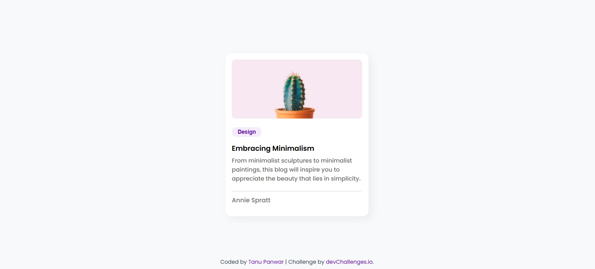

# 📌 Blog Card

A simple and responsive **blog card component** built using **HTML & CSS**. This project was created as part of **devChallenges.io** to practice styling and responsiveness.

## 🌟 Features
- Fully responsive design using **CSS media queries**
- Clean and minimal UI
- Perfect for blog previews or card-based layouts

## 🛠️ Technologies Used
- HTML
- CSS (Flexbox & Media Queries)

## 📸 Preview


## 🚀 Live Demo
🔗 [View Live](https://tanu-panwar.github.io/Blog-Card/)

## 📂 How to Use
1. Clone this repository:
   ```sh
   git clone https://github.com/Tanu-panwar/Blog-Card.git
